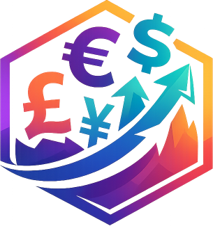

# fundsr 

fundsr imports fund NAVs and index levels and creates tracking difference plots (CAGR and log-return). Plotting Xetra liquidity data (XLM) is also supported.

## Installation
<!-- badges: start -->
[](https://github.com/StanTraykov/fundsr/actions/workflows/R-CMD-check.yaml)
<!-- badges: end -->
```r
# install.packages("pak")

# Stable (latest release):
pak::pak("StanTraykov/fundsr@*release")

# Development:
pak::pak("StanTraykov/fundsr")
```

### From my r-universe (binary builds of latest release)
[](https://stantraykov.r-universe.dev/fundsr)
```r
install.packages(
  "fundsr",
  repos = c("https://stantraykov.r-universe.dev",  "https://cloud.r-project.org")
)
```

# Output


## Usage
* [Importing Data and Computing Differences](https://stantraykov.github.io/fundsr/articles/importing-and-computing-differences.html)
* [Simple Demo Using Real Data](https://stantraykov.github.io/fundsr/articles/simple-demo-using-real-data.html)
* [Survival Curves for Financial Planning](https://stantraykov.github.io/fundsr/articles/survival-curves-for-financial-planning.html)
* `scripts/examples` in the package directory (locate via `system.file("scripts/examples", package="fundsr")`)
  * `glob_funds.R` is an example workflow plotting global funds, but data needs to be downloaded separately
  * `all_funds.R` features many more funds
* [Reference](https://stantraykov.github.io/fundsr/reference/index.html)

## Disclaimer
This project is provided for informational and analytical purposes (commentary and performance comparison). Charts and statistics shown are derived measures (e.g., tracking differences/return differentials) and are not intended to reproduce or redistribute underlying benchmark or index datasets. Any third-party material, where present, is shown only as necessary for identification and discussion and is provided as low-resolution raster images (not high-resolution or vector graphics) to prevent reuse as a substitute for source data.
All trademarks and registered trademarks are the property of their respective owners. References to products, indices, and providers are for identification purposes only and do not imply endorsement or affiliation. Use is intended to fall within applicable copyright exceptions/limitations (such as quotation for criticism/review), to the extent permitted by law.
