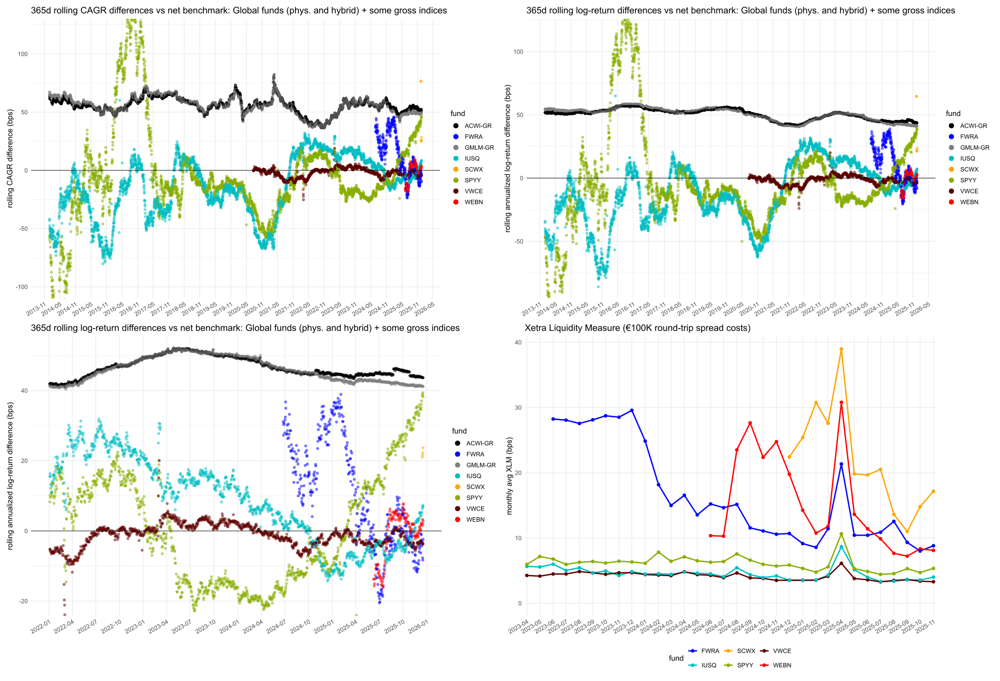

# Overview

fundsr imports fund NAVs and index levels and creates tracking difference plots (CAGR and log-return). Plotting Xetra liquidity data (XLM) is also supported.

# Installation
```r
# install.packages("pak")

# Stable: latest release
pak::pak("StanTraykov/fundsr@*release")

# Development: (main branch)
pak::pak("StanTraykov/fundsr")
```

# Usage
* [Intro vignette](https://stantraykov.github.io/fundsr/articles/fundsr-intro.html) contains a simple walkthrough comparing IUSQ and SPYY (no data setup needed)
* `inst/scripts/examples` (e.g. open `.Rproj` file in R Studio after installing the package)
  * `glob_funds.R` is a more comprehensive example featuring global funds but requiring index & fund data download outside the package
  * `all_funds.R` and `all_funds-GR.R` feature many more funds for analysis vs net/gross benchmark
* [Reference](https://stantraykov.github.io/fundsr/reference/index.html)

# Importing data
Fund and index data are stored in fundsr's storage environment as tibbles / dfs with date columns and one or more value columns. Index level columns must be in upppercase (e.g. `ACWI`, `FTAW`). Fund NAV columns must be in lowercase (e.g. `spyy`, `vwce`).

## Funds

### Supported formats (Amundi, HSBC, Invesco, iShares, SPDR, UBS, Xtrackers)
Fund providers allow downloading a NAV history in Excel format (even if it's sometimes incomplete). iShares and SPDR downloads can be automated easily and fundsr supports this via the [`add_fund_urls()`](https://stantraykov.github.io/fundsr/reference/add_fund_urls.html) and [`download_fund_data()`](https://stantraykov.github.io/fundsr/reference/download_fund_data.html) functions—see the intro vignette for more info. For the others, manual downloads (or non-trivial automation) seem necessary. In this case, the fund `.xls` or `.xlsx` file must be made available to fundsr in the data directory. If the filename matches the ticker (e.g. `FWRA.xlsx`) it can be imported without specifying a file.
```r
add_data_loader(function () {
inve("FWRA", benchmark = "FTAW")
amun("WEBN", benchmark = "GMLM", file = "NAV History_Amundi Prime All Country World UCITS ETF Acc_IE0003XJA0J9_10_06_2024.xlsx")
}
run_data_loaders()
```

### Other funds
Prepare a tibble/dataframe or a CSV file with a date column and one or more data columns that must be lowercase for funds (e.g. `sxr8`, `vwce`, `spyy`) and uppercase for indices (e.g. `SP500`, `FTAW`, `ACWI`). Suppose you have a dataframe ``funds_data`` with fund NAVs and a CSV file with index levels. You can import them via:
```r
add_data_loader(function() {
    fi_map <- c(
        fwra = "FTAW",
        webn = "GMLM",
        vwce = "FTAW", 
        spyy = "ACWI",
        spyi = "ACWI_IMI",
        iusq = "ACWI")
    store_timeseries("funds", funds_data, fund_index_map = fi_map)
    store_timeseries("indices", read_timeseries("indices.csv", time_unit = "ms"))
})
run_data_loaders()
```
**Note:** Dates in the CSV file must be Unix epoch timestamps (in second or millisecond precision), see [`read_timeseries()`](https://stantraykov.github.io/fundsr/reference/read_timeseries.html). If your dates are in another format, get the data via `readr::read_csv()` and ensure the dates are parsed either via `read_csv`'s `col_types` argument or later (e.g. mutate using `lubridate::parse_date_time()`).

## Indices

### From fund files

Some fund providers' files include index series. These can be retrieved when importing the fund (supported for iShares, Xtrackers, Invesco), e.g.
```r
add_data_loader(function() {
    spdr("SPYY", benchmark = "ACWI")
    ishs("IUSQ", benchmark = "ACWI", retrieve_benchmark = TRUE) # retrieve ACWI (R) from fund file
    inve("FWRA", benchmark = "FTAW", retrieve_benchmark = TRUE) # retrieve FTSE All-World (R) from fund file
})
```
Index series retrieved in this way may have holes (e.g. fund domicile holidays and such) that can potentially remove data points for funds that did publish a NAV for that day (e.g. different domicile). The overall effect on plots is negligible, however.

### MSCI
MSCI provides [end-of-day level downloads](https://www-cdn.msci.com/web/msci/index-tools/end-of-day-index-data-search). These can be imported by the provided [`msci()`](https://stantraykov.github.io/fundsr/reference/msci.html) function.

### FTSE & Solactive
These index providers make it more difficult to get index levels for free.

# Disclaimer
This project is provided for informational and analytical purposes (commentary and performance comparison). Charts and statistics shown are derived measures (e.g., tracking differences/return differentials) and are not intended to reproduce or redistribute underlying benchmark or index datasets. Any third-party material, where present, is shown only as necessary for identification and discussion and is provided as low-resolution raster images (not high-resolution or vector graphics) to prevent reuse as a substitute for source data.
All trademarks and registered trademarks are the property of their respective owners. References to products, indices, and providers are for identification purposes only and do not imply endorsement or affiliation. Use is intended to fall within applicable copyright exceptions/limitations (such as quotation for criticism/review), to the extent permitted by law.
