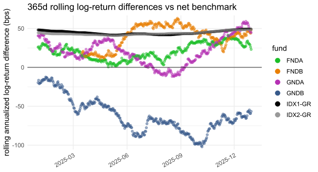

# fundsr 

[](https://github.com/StanTraykov/fundsr/actions/workflows/R-CMD-check.yaml)
[](https://stantraykov.r-universe.dev/fundsr)

fundsr plots tracking differences (CAGR and log-return) and survival curves.

## Installation
```r
# install.packages("pak")

# Stable (latest release):
pak::pak("StanTraykov/fundsr@*release")

# Development:
pak::pak("StanTraykov/fundsr")
```

### From my r-universe (binary builds of latest release)
```r
install.packages(
  "fundsr",
  repos = c("https://stantraykov.r-universe.dev",  "https://cloud.r-project.org")
)
```

## Overview

fundsr is an analysis tool for DIY investors. It does not include or provide market data; users are responsible for sourcing any ETF NAV and index-level data they use, subject to the terms of their data sources. The package also supports plotting survival curves.

## Usage
* [Importing Data and Computing Differences](https://stantraykov.github.io/fundsr/articles/importing-and-computing-differences.html)
* [Survival Curves for Financial Planning](https://stantraykov.github.io/fundsr/articles/survival-curves-for-financial-planning.html)
* See also `scripts/examples` in the package directory (locate via `system.file("scripts/examples", package="fundsr")`)
* [Options](https://stantraykov.github.io/fundsr/reference/fundsr_options.html)
* [Reference](https://stantraykov.github.io/fundsr/reference/index.html)

## Output

