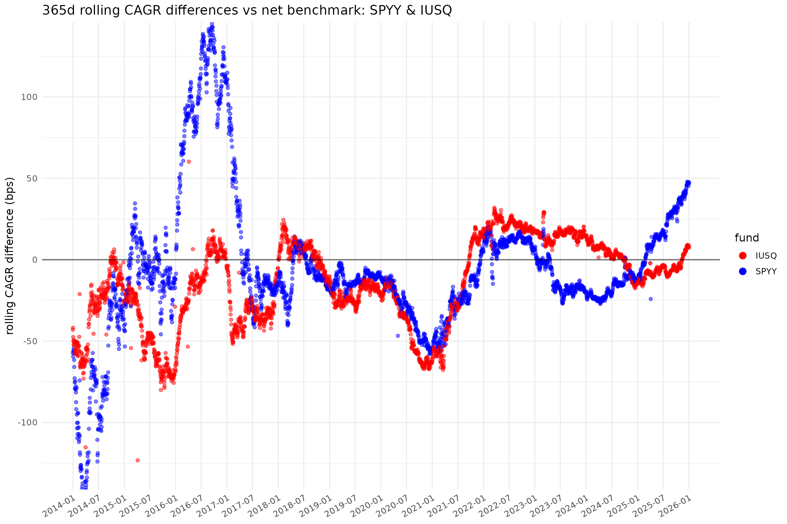
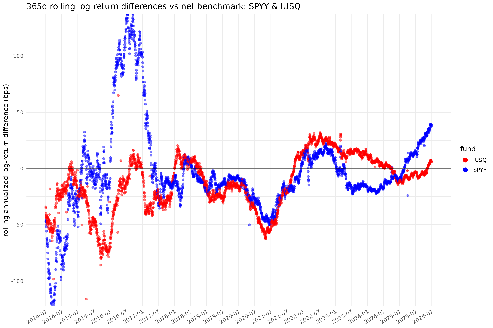
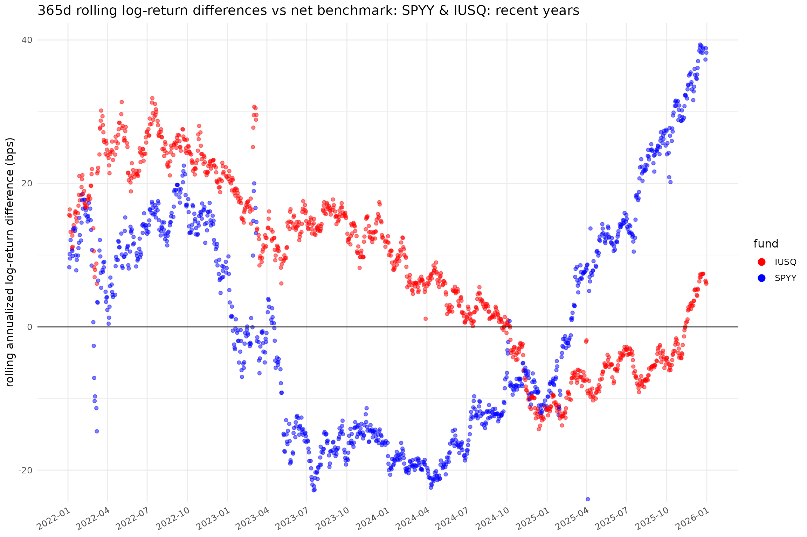
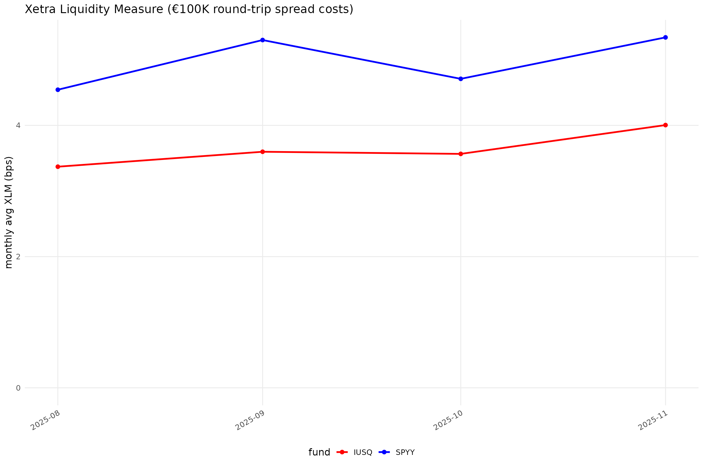
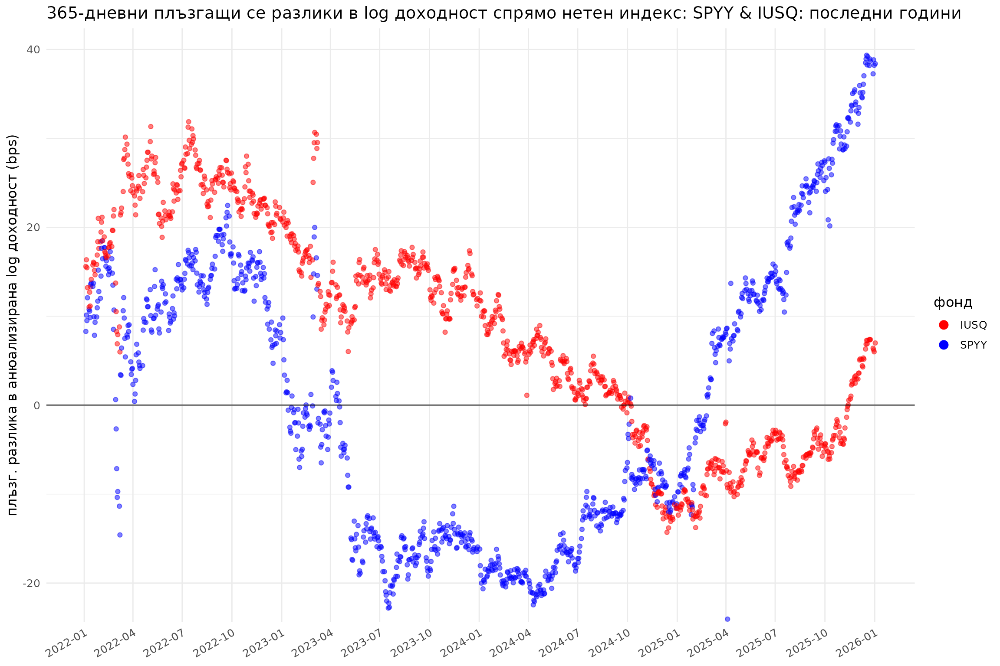
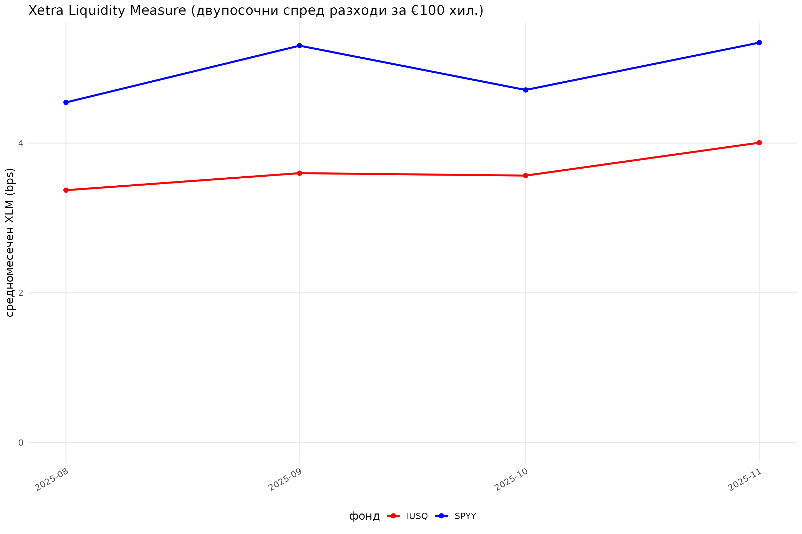

# fundsr-intro: Rolling differences and Xetra liquidity plots

## Setup

``` r
library(dplyr)
#> 
#> Attaching package: 'dplyr'
#> The following objects are masked from 'package:stats':
#> 
#>     filter, lag
#> The following objects are masked from 'package:base':
#> 
#>     intersect, setdiff, setequal, union
library(ggplot2)
library(lubridate)
#> 
#> Attaching package: 'lubridate'
#> The following objects are masked from 'package:base':
#> 
#>     date, intersect, setdiff, union
library(fundsr)
#> fundsr loaded.
```

Set up directories.

``` r
dirs <- c(
    data = file.path("data", "funds"),
    xlm = file.path("data", "xlm"),
    out = "output"
)
for (d in dirs) {
    dir.create(d, recursive = TRUE)
}
```

Populate the XLM directory with some monthly XLM reports

``` r
xlm_urls <- c(
    "https://www.cashmarket.deutsche-boerse.com/resource/blob/4844258/91ce589f5309cbbd1ad0c92b3e6cdbda/data/20251130-ETF-ETP-Statistic.xlsx",
    "https://www.cashmarket.deutsche-boerse.com/resource/blob/4795286/394c4451af562507f9def3f39da62242/data/20251031-ETF-ETP-Statistic.xlsx",
    "https://www.cashmarket.deutsche-boerse.com/resource/blob/4725636/2d62a1677b537d996aefc45df3ff21d3/data/20250930-ETF-ETP-Statistic.xlsx",
    "https://www.cashmarket.deutsche-boerse.com/resource/blob/4674370/0de847380722e8e87bc821cb5313ba41/data/20250831-ETF-ETP-Statistic.xlsx"
)
for (url in xlm_urls) {
    fname <- basename(url)
    dest_path <- file.path(dirs[["xlm"]], fname)
    if (!file.exists(dest_path)) {
        download.file(url, destfile = dest_path, mode = "wb", quiet = TRUE)
        Sys.sleep(stats::runif(1, 0.5, 1.0))
    }
}
```

Import all XLM files into a tibble

``` r
if (!exists("xlm_data")) {
    xlm_data <- read_xlm_directory(dirs[["xlm"]])
}
#> XLM read: August 2025
#> XLM read: September 2025
#> XLM read: October 2025
#> XLM read: November 2025
```

Set package options

``` r
fundsr_options(
    data_dir = dirs[["data"]],
    out_dir = dirs[["out"]],
    # internal_png = TRUE, # output PNGs without Inkscape (lower quality)
    
    # Inkscape executable for higher-quality PNG export
    # (uncomment depending on system or comment all to disable)
    inkscape = "C:/Program Files/Inkscape/bin/inkscape.exe",
    # inkscape = "/Applications/Inkscape.app/Contents/MacOS/Inkscape",
    # inkscape = "/usr/bin/inkscape",
    # inkscape = Sys.which("inkscape"), # if it's on PATH (usually not on Win/Mac)
)

# Helper to add urls to option fundsr.fund_urls
add_fund_urls(c(
    IUSQ = "https://www.ishares.com/uk/individual/en/products/251850/ishares-msci-acwi-ucits-etf/1535604580409.ajax?fileType=xls&fileName=iShares-MSCI-ACWI-UCITS-ETF-USD-Acc_fund&dataType=fund",
    SPYY = "https://www.ssga.com/ie/en_gb/institutional/library-content/products/fund-data/etfs/emea/navhist-emea-en-spyy-gy.xlsx"
))
```

## Get fund data

Populate funds directory (download files in `fundsr.fund_urls` option)

``` r
download_fund_data()
#> Downloading 'IUSQ'
#> Downloading 'SPYY'
```

Register data loader

``` r
add_data_loader(function() {
    spdr("SPYY", benchmark = "ACWI") # automatically attempts to read <ticker>.xls[x]
    ishs("IUSQ", benchmark = "ACWI", retrieve_benchmark = T) # also retrieve ACWI from file
})
```

Get fund and index data into a big tibble

``` r
series <- build_all_series() %>%
    filter(date >= as_date("2012-12-29"))
#> *** Loading: spyy
#> Attempting readxl on 'data/funds/SPYY.xlsx'...
#> readxl succeeded. Returning data.
#> Returning 3729 rows x 2 columns from 'data/funds/SPYY.xlsx' (sheet='1', date_field='^Date').
#> *** Loading: iusq
#> Attempting readxl on 'data/funds/IUSQ.xls'...
#> readxl failed. Attempting parse as Excel 2003 XML...
#> Returning 3623 rows x 3 columns from 'data/funds/IUSQ.xls' (sheet='Historical', date_field='^As Of').
#> Joining: spyy, iusq
```

Check contents

``` r
series %>% filter(date >= as_date("2015-04-03"))
#> # A tibble: 2,759 × 4
#>    date        spyy  iusq  ACWI
#>    <date>     <dbl> <dbl> <dbl>
#>  1 2015-04-06   NA   38.2  153.
#>  2 2015-04-07  101.  38.5  154.
#>  3 2015-04-08  101.  38.6  154.
#>  4 2015-04-09  101.  38.7  154.
#>  5 2015-04-10  102.  38.9  155.
#>  6 2015-04-13  102.  38.8  155.
#>  7 2015-04-14  102.  38.9  155.
#>  8 2015-04-15  102.  39.0  156.
#>  9 2015-04-16  102.  39.1  156.
#> 10 2015-04-17  101.  38.7  155.
#> # ℹ 2,749 more rows
get_fund_index_map()
#>   spyy   iusq 
#> "ACWI" "ACWI"
```

## Calculate CAGR & log diffs

``` r
nd <- 365
diffs <- roll_diffs(series, nd, get_fund_index_map())
#> Roll diffs spyy -> ACWI
#> Roll diffs iusq -> ACWI
```

## Plot specs

``` r
no_filter <- NULL
zoom_filter <- function(x) {x %>% filter(date >= as_date("2022-01-01"))}
acwi_funds <- c("spyy", "iusq")
gg_par <- scale_color_manual(values = c("iusq" = "red", "spyy" = "blue"), labels = toupper)

plot_spec <- tribble(
    ~plot_id, ~title, ~data_filter,
    ~gg_params, ~width,  ~height,
    ~funds,

    "ACWI", "SPYY & IUSQ", no_filter,
    gg_par, 14, 9,
    acwi_funds,

    "ACWIz",
    c(en = "SPYY & IUSQ: recent years",
      bg = "SPYY & IUSQ: последни години"),
    zoom_filter,
    gg_par, 14, 9,
    acwi_funds
)
```

## Run!

Run the plots! This outputs SVG files and queues plots for optional PNG
export using Inkscape (see blow). It may also output lower-quality PNGs
(if option `fundsr.internal_png` is `TRUE`).

``` r
p <- run_plots(diffs, nd, plot_spec, xlm_data)
#> plot_roll_diffs: 365d rolling CAGR differences vs net benchmark: SPYY & IUSQ
#> plot_xlms: spyy, iusq
#> plot_roll_diffs: 365d rolling log-return differences vs net benchmark: SPYY & IUSQ
#> plot_roll_diffs: 365d rolling CAGR differences vs net benchmark: SPYY & IUSQ: recent years
#> plot_roll_diffs: 365d rolling log-return differences vs net benchmark: SPYY & IUSQ: recent years
```

## Output

``` r
p[["ACWI"]]
```



``` r
p[["ACWI_L"]]
```



``` r
p[["ACWIz_L"]]
```



``` r
p[["xlm_ACWI"]]
```



Corresponding SVG files should be in the `output` directory.

## Plot in another language

``` r
Sys.setlocale("LC_MESSAGES", "bg_BG.UTF-8") # needed on some systems
#> [1] "bg_BG.UTF-8"
Sys.setLanguage("bg")
plot_spec_bg <- plot_spec %>%
    mutate(plot_id = paste0(plot_id, "_bg"))
bg_p <- run_plots(diffs, nd, plot_spec_bg, xlm_data)
#> plot_roll_diffs: 365-дневни плъзгащи се CAGR разлики спрямо нетен индекс: SPYY & IUSQ
#> plot_xlms: spyy, iusq
#> plot_roll_diffs: 365-дневни плъзгащи се разлики в log доходност спрямо нетен индекс: SPYY & IUSQ
#> plot_roll_diffs: 365-дневни плъзгащи се CAGR разлики спрямо нетен индекс: SPYY & IUSQ: последни години
#> plot_roll_diffs: 365-дневни плъзгащи се разлики в log доходност спрямо нетен индекс: SPYY & IUSQ: последни години
bg_p[["ACWIz_bg_L"]]
```



``` r
bg_p[["xlm_ACWI_bg"]]
```



## Optional: higher-quality PNG export

``` r
export_pngs()
#> Executing "C:/Program Files/Inkscape/bin/inkscape.exe" --actions="export-background:white;file-open:output/ACWI.svg;export-filename:output/ACWI.png;export-width:1300;export-do;file-close;file-open:output/xlm_ACWI.svg;export-filename:output/xlm_ACWI.png;export-width:1300;export-do;file-close;file-open:output/ACWI_L.svg;export-filename:output/ACWI_L.png;export-width:1300;export-do;file-close;file-open:output/ACWIz.svg;export-filename:output/ACWIz.png;export-width:1300;export-do;file-close;file-open:output/ACWIz_L.svg;export-filename:output/ACWIz_L.png;export-width:1300;export-do;file-close;file-open:output/ACWI_bg.svg;export-filename:output/ACWI_bg.png;export-width:1300;export-do;file-close;file-open:output/xlm_ACWI_bg.svg;export-filename:output/xlm_ACWI_bg.png;export-width:1300;export-do;file-close;file-open:output/ACWI_bg_L.svg;export-filename:output/ACWI_bg_L.png;export-width:1300;export-do;file-close;file-open:output/ACWIz_bg.svg;export-filename:output/ACWIz_bg.png;export-width:1300;export-do;file-close;file-open:output/ACWIz_bg_L.svg;export-filename:output/ACWIz_bg_L.png;export-width:1300;export-do;file-close"
#> [1] 0
```
