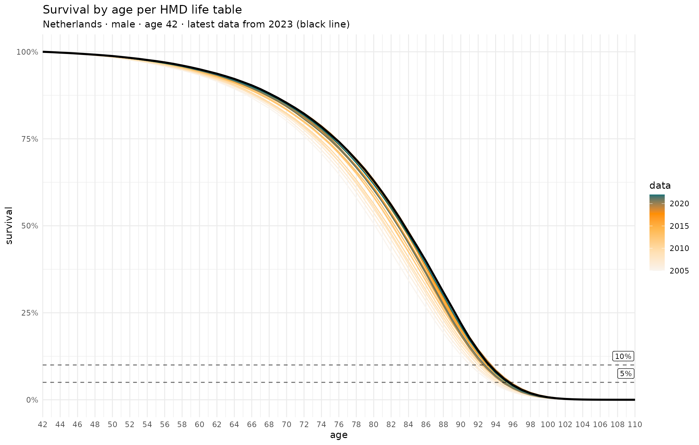
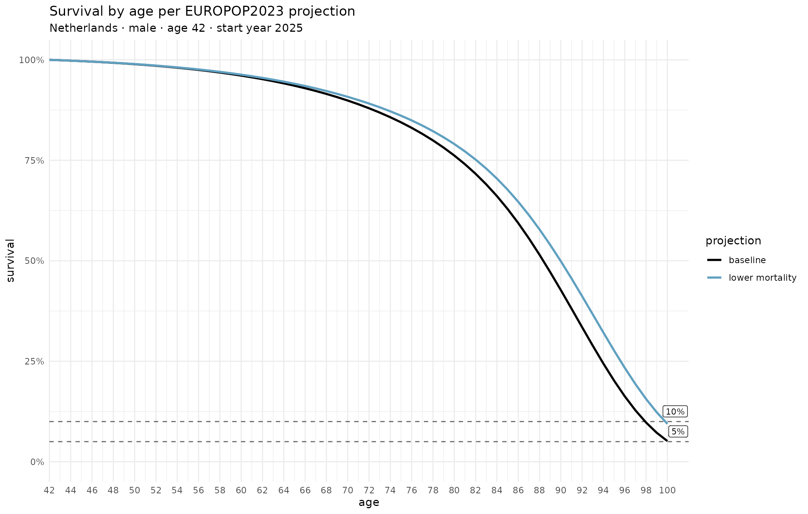

# Survival Curves for Financial Planning

## Setup

``` r
library(fundsr)
#> fundsr loaded.

fundsr_options(
    out_dir = "output", # where to write plots
    export_svg = TRUE, # whether to export SVG files
    px_width = 1700, # for optional PNG output (internal or via Inkscape)
    # internal_png = TRUE, # whether to export PNGs via ggplot2 (lower quality)

    # Inkscape executable for higher-quality PNG export. Discovered auto-
    # matically on most systems (Win/Mac/*ux). Set manually, if that fails:
    # inkscape = "/usr/bin/inkscape"
    # inkscape = "C:/Program Files/Inkscape/bin/inkscape.exe"
    # inkscape = "/Applications/Inkscape.app/Contents/MacOS/Inkscape"
)

data_dir <- file.path("data", "life")
dir.create(data_dir, recursive = TRUE, showWarnings = FALSE)
```

## Get the data

Download from HMD and EUROSTAT, see
[wiki](https://github.com/StanTraykov/fundsr/wiki/Life-stats) for links
and more info.

Eurostat makes the download available directly:

``` r
dest_path <- file.path(data_dir, "estat_proj_23naasmr.tsv.gz")
if (!file.exists(dest_path)) {
    download.file("https://ec.europa.eu/eurostat/api/dissemination/sdmx/2.1/data/proj_23naasmr?format=TSV&compressed=true", destfile = dest_path, mode = "wb")
}
```

HMD requires login but licenses CC-BY, so I host (potentially outdated)
data for this vignette. You may download current data directly from HMD
for actual use (it’s free).

- HMD. Human Mortality Database. Max Planck Institute for Demographic
  Research (Germany), University of California, Berkeley (USA), and
  French Institute for Demographic Studies (France). Available at
  www.mortality.org. See data repo
  [README.md](https://github.com/StanTraykov/fundsr-data/blob/main/README.md)
  for more details.

``` r
hmd_urls <- c(
    "https://raw.githubusercontent.com/StanTraykov/fundsr-data/main/hmd/mltper_1x1.txt.gz",
    "https://raw.githubusercontent.com/StanTraykov/fundsr-data/main/hmd/fltper_1x1.txt.gz"
)

for (url in hmd_urls) {
    fname     <- basename(url)
    dest_path <- file.path(data_dir, fname)
    if (!file.exists(dest_path)) {
        download.file(url, destfile = dest_path, mode = "wb")
    }
}
```

The next steps assume the following files are in the `data_dir`
(`data/life`) directory:

    [data/life] $ ls
    estat_proj_23naasmr.tsv.gz  fltper_1x1.txt.gz  mltper_1x1.txt.gz

## Plot survival chances per HMD life tables

``` r
# Dutch male, age 42

lt_male <- read_life_table(data_dir, "m", look_back = 20)

# Use HMD population code (usually but not always ISO 3-letter)
hmd_ca <- chance_alive(lt_male, "NLD", 42) 

# Get a ggplot2 object; 2nd and 3rd argument passed just to label the plot
hmd_p <- plot_chance_alive(hmd_ca, "m", "Netherlands")

# Save SVG file, queue PNG output (or write PNG directly, depending on config)
save_plot("hmd_plot", hmd_p, width = 11, height = 7, px_width = 1700)
```

### Output

``` r
hmd_p
```



## Plot survival chances per EUROPOP23 projections (baseline and lower mortality scenario)

``` r
# Dutch male, age 42; use projected age x calendar year mortality starting from 2025

# Table contains both sexes
es <- read_es_aasmr(data_dir)
#> Warning: There were 2 warnings in `mutate()`.
#> The first warning was:
#> ℹ In argument: `Age = dplyr::case_when(...)`.
#> Caused by warning:
#> ! NAs introduced by coercion
#> ℹ Run `dplyr::last_dplyr_warnings()` to see the 1 remaining warning.

# Use Eurostat 'geo' code (2-letter country code)
es_ca <- chance_alive_es_aasmr(es, "NL", "m", 42, 2025) 

# Get a ggplot2 object; 2nd and third argument passed just to label the plot
es_p <- plot_chance_alive_es_aasmr(es_ca, "m", "Netherlands")

# Save SVG file, queue PNG output (or write PNG directly, depending on config)
save_plot("es_plot", es_p, width = 11, height = 7, px_width = 1700)
```

### Output

``` r
es_p
```



## Optional: export PNGs via Inkscape

``` r
export_pngs()
```
