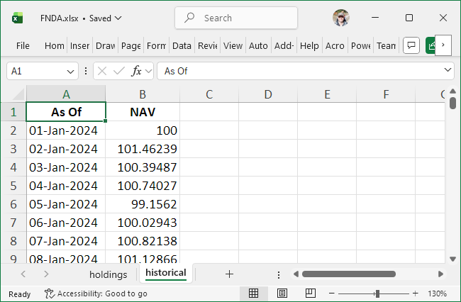

```{r, include = FALSE}
knitr::opts_chunk$set(
    collapse = TRUE,
    comment = "#>",
    fig.retina = 1,
    dpi = 96
)
```

```{=html}
<style>
.figure p.caption, .figcaption, .table caption {
    color: #646464;
    font-size: 0.92em;
    margin-bottom: 1.2em;
}

.teaser-figure {
    margin-top: 0;
    margin-bottom: 1.6em;
    margin-left: auto;
    margin-right: auto;
    text-align: center;
}
</style>
```

```{r setup, include = FALSE}
library(dplyr)
library(ggplot2)
library(grid)
library(lubridate)
library(fundsr)

ks <- function(x,
               bootstrap_options = c("striped", "condensed", "responsive"),
               full_width = TRUE,
               ...) {
    if (requireNamespace("kableExtra", quietly = TRUE)) {
        kableExtra::kable_styling(x,
                                  bootstrap_options = bootstrap_options,
                                  full_width = full_width,
                                  ...)
    } else {
        x
    }
}


in_pkgdown <- isTRUE(
    tryCatch(
        if (requireNamespace("pkgdown", quietly = TRUE)) pkgdown::in_pkgdown() else FALSE,
        error = function(e) FALSE
    )
)

have_dia <- requireNamespace("DiagrammeR", quietly = TRUE)
fig_align <- if (in_pkgdown) "left" else "center"

plot_workflow_diagram <- function() {
  labels <- c("load data from files", "build master table", "calculate diffs", "plot")
  n <- length(labels)
  x <- seq_len(n)
  y <- rep(0, n)
  box_w <- 0.85
  box_h <- 0.18
  boxes <- data.frame(
    xmin = x - box_w / 2,
    xmax = x + box_w / 2,
    ymin = y - box_h / 2,
    ymax = y + box_h / 2,
    lab  = labels
  )
  arrows <- data.frame(
    x    = x[-n] + box_w / 2,
    xend = x[-1] - box_w / 2,
    y    = 0,
    yend = 0
  )
  ggplot2::ggplot() +
    ggplot2::geom_rect(
      data = boxes,
      ggplot2::aes(xmin = xmin, xmax = xmax, ymin = ymin, ymax = ymax),
      fill = "white",
      color = "#1f4aff",
      linewidth = 0.8
    ) +
    ggplot2::geom_text(
      data = boxes,
      ggplot2::aes(x = (xmin + xmax) / 2, y = (ymin + ymax) / 2, label = lab),
      size = 5.6
    ) +
    ggplot2::geom_segment(
      data = arrows,
      ggplot2::aes(x = x, y = y, xend = xend, yend = yend),
      color = "#1f4aff",
      linewidth = 0.8,
      lineend = "round",
      arrow = grid::arrow(type = "closed", length = grid::unit(3.2, "mm"))
    ) +
    ggplot2::coord_cartesian(xlim = c(0.5, n + 0.5), ylim = c(-0.4, 0.4), expand = FALSE) +
    ggplot2::theme_void()
}

```

```{r pkgd-style, echo=FALSE, results="asis"}
if (in_pkgdown) {
    cat(
"<style>
.figure p.caption {
    margin-top: 0.92ex;
}
</style>
")
}
```


```{r, echo=FALSE, results="asis", fig.cap="A glimpse of the final result"}
cat('<div class="teaser-figure">')
knitr::include_graphics("figures/example-plot.png")
cat('</div>')
```

This vignette introduces data loading and tracking-difference calculations using the example data files shipped with fundsr. For a demonstration based on NAV histories downloaded from fund providers—which also covers liquidity plots and translation support—see [Simple Demo Using Real Data](https://stantraykov.github.io/fundsr/articles/simple-demo-using-real-data.html). More complex workflows are provided (without data) under `scripts/examples` in the package directory; start with `glob_funds.R` or `all_funds.R`. The directory can be located with `system.file("scripts/examples", package = "fundsr")`.

## The master table

fundsr’s core workflow (Figure 1) consists of reading daily fund NAVs and index levels from files and building a master series table. Plottable tracking differences are computed from this table via `roll_diffs()`.

```{r wf-dia, echo=FALSE, message=FALSE, warning=FALSE, fig.cap="Figure 1: Rolling differences workflow", fig.width=10, fig.height=2, out.width = "100%"}

if (isTRUE(have_dia)) {
  DiagrammeR::grViz("
  digraph {
    graph [rankdir = LR]
    node [shape=box, style=rounded, color=blue];
    'load data from files' -> 'build master table' -> 'calculate diffs' -> 'plot';
  }
  ", width = "100%")
} else {
  plot_workflow_diagram()
}
```

The master table has a date column named `date` and one column per series (either fund NAVs or net/gross index levels; see Table 1 for an example). Fund NAV columns use lowercase names by convention (e.g. `spyy`). Index level columns are typically uppercase (e.g. `ACWI`, `GMLM`, `SP500`) or mixed-case with an initial uppercase letter (e.g. `WxUSA`). Net total return levels are stored under a shortened index name, while gross total return levels are identified by a `-GR` suffix (e.g. `ACWI-GR`, `SP500-GR`).

**Note:** The lowercase naming is useful because fund identifiers (typically tickers) may coincide with index names (e.g. Amundi's ACWI). The `-GR` suffix is the default value of the `gross_suffix` parameter in `roll_diffs()`, which is used to switch between net and gross calculations.

**IMPORTANT:** Only NAV histories of accumulating funds are valid inputs, as these are equivalent to total return series. fundsr does **not** support total return calculation for distributing ETFs and using it with such NAVs will produce garbage. (I am not aware of a free source of comprehensive distribution histories for UCITS ETFs that would allow reconstruction of total return.)

```{r, echo=FALSE}
funds_and_indexes <- structure(list(date = structure(c(20375, 20376, 20377, 20378, 
    20381, 20382, 20383), class = "Date"), iusq = c(104.5, 105.2, 
    105.1, 105.1, 106.3, 106.2, 105.8), spyi = c(279.6, 281.7, 281.4, 
    281.1, 284.5, 284.3, 283.1), spyy = c(277.5, 279.5, 279.3, 279.2, 
    282.5, 282.3, 281.2), webn = c(12.57, 12.67, 12.66, 12.65, 12.8, 
    12.79, 12.74), scwx = c(11.67, 11.75, 11.74, 11.73, 11.87, 11.86, 
    11.82), ACWI = c(536.7, 540.6, 540, 539.8, 546.3, 545.8, 543.6
    ), `ACWI-GR` = c(2307, 2324, 2321, 2320, 2348, 2346, 2337), GMLM = c(2467, 
    2485, 2483, 2481, 2511, 2508, 2499), `GMLM-GR` = c(2569, 2588, 
    2586, 2584, 2615, 2613, 2603)), row.names = c(NA, -7L), class = "data.frame")
knitr::kable(funds_and_indexes,
             caption = "Table 1: A master series table (illustrative example; values rounded)") %>% ks()
```

## Setup
```{r libs, eval=FALSE}
library(dplyr)
library(ggplot2)
library(lubridate)

library(fundsr)
```

`fundsr_options()` can be used to set (and sanity-check) package options.

fundsr reads fund NAVs and index levels from a single directory specified via the `fundsr.data_dir` option. The following code sets it to the `extdata` directory shipped with the package. The plot output directory is set to `output` (option `fundsr.out_dir`).

```{r fundsr-opt}
fundsr_options(
    data_dir = system.file("extdata", package = "fundsr"),
    out_dir = "output", # where to store plots
    export_svg = TRUE, # output SVG (main workflow)
    
    px_width = 1300, # for optional PNG output
    # internal_png = TRUE, # output PNG using ggplot2

    # Need to set path only if auto-detection fails    
    # inkscape = "path/to" # optional PNG output via Inkscape
)
```

**Note:** In normal use, fundsr may also write to the data directory, if `download_fund_data()` is used.

## Importing

Importing usually involves reading fund NAVs and index levels from Excel, CSV, or TSV files into data frames and storing them in fundsr's cached storage environment, from which the master table is constructed (typically via a single call to `build_all_series()`). A fund→index map, required for tracking-difference calculations, is maintained and updated as new series are added.

The example files in Table 2 (shipped with the package in `extdata`) are used to demonstrate the importing functions.

```{r, echo=FALSE, message=FALSE}
example_files <- tribble(~File, ~Type, ~Description,
                 "FNDA.xlsx", "Excel", "NAVs for fund FNDA tracking IDX1",
                 "FNDB.xlsx", "Excel", "FNDB tracking IDX1, fund launched 2024-03-16",
                 "GNDA.xlsx", "Excel", "NAVs for fund GNDA tracking IDX2",
                 "GNDB.csv",    "CSV", "NAVs for fund GNDB tracking IDX2",
                 "IDX1.xlsx", "Excel", "index levels for IDX1, net and gross",
                 "IDX2G.csv",   "CSV", "index levels for IDX2, gross return",
                 "IDX2N.csv",   "CSV", "index levels for IDX2, net return")
knitr::kable(example_files,
             caption = "Table 2: Example input files") %>% ks()
```

### `store_timeseries()`

`store_timeseries()` is the basic function for importing into the storage environment. It is most commonly used via wrappers such as `load_fund()` or the vendor-specific wrappers around `load_fund()`---handling Excel NAV histories from Amundi, HSBC, Invesco, iShares, SPDR, UBS, Vanguard, and Xtrackers. It is often called directly when importing CSV/TSV files or data frames.

The example fund GNDB has a NAV history in CSV format with dates expressed as milliseconds since the Unix epoch, a NAV column, and a Benchmark column that will not be imported from the fund file in this example.

```
Date,NAV,Benchmark
1704067200000,100,100
1704153600000,101.595595,101.588368
1704240000000,100.510764,100.494977
```

GNDB's NAV data can be loaded into fundsr's storage environment by reading it as a `tibble` via `read_timeseries()`. `read_timeseries()` recognizes the date format, parses the dates, and renames the date column to `date`, as required for the master table. The `NAV` column from the CSV file has to be renamed separately to a lowercase fund identifier for the master table. The `select()` in the middle of the pipeline ensures the extraneous `Benchmark` column is not included (we will import the benchmark later from its own file).

```{r store-timeseries}
store_timeseries(
    var_name = "gndb",
    expr = read_timeseries("GNDB.csv", date_col = "Date") |>
        select(date, NAV) |>
        rename(gndb = NAV),
    fund_index_map = c(gndb = "IDX2")
)
```

The variable name used for the storage environment (`var_name`) can be chosen arbitrarily and serves as the cache key. The `fund_index_map` parameter defines a mapping from fund identifier to its corresponding index identifier.

**Note:** To make use of caching, the expression supplied via the `expr` parameter should **not** contain a ready-made tibble or similar, constructed outside of the call. It should contain a function call or pipeline that performs the potentially costly operations, like loading from Excel, the Internet, etc. If `var_name` is already present in fundsr's storage environment, the expression will **not** be evaluated at the time of the `store_timeseries()` call, unless a reload is being requested or the `overwrite` parameter to `store_timeseries()` is `TRUE`. (See [Using data loaders](#using-data-loaders) and [Resetting and reloading](#resetting-and-reloading).)

When loading gross indices, the convention is to map them to the net index in the fund_index_map (e.g. `SP500-GR`→`SP500`). This allows gross indices to be plotted against net indices. When plotted against the net index, the gross index serves a reference equivalent to an ETF with perfect tracking, no withholding taxes, and no ongoing fees.

The following code block uses `store_timeseries()` to load the `IDX1` and `IDX2` indices, tracked by the example funds. `read_timeseries_excel()` flexibly reads Excel files and accepts a `col_trans` argument to translate Excel columns (matched using regular expressions) to imported columns. `IDX2` is imported into a single variable (`idx2`) by joining the net and gross time series (via `dplyr::full_join()`). The columns in `IDX2{N,G}.csv` are already appropriately named for the master table. Importing the files into separate variables via two calls to `store_timeseries()` would lead to the same master table.

```{r store-timeseries2}
store_timeseries(
    var_name = "idx1",
    expr = read_timeseries_excel(
        file = "IDX1.xlsx",
        sheet = 1,
        date_col = "^Date",
        col_trans = c("IDX1"    = "^Index One Net",
                      "IDX1-GR" = "^Index One Gross"),
        date_order = "dmy"
    ),
    fund_index_map = c(`IDX1-GR` = "IDX1")
)

store_timeseries(
    var_name = "idx2",
    expr = full_join(read_timeseries("IDX2N.csv"),
                     read_timeseries("IDX2G.csv"),
                     by = "date"),
    fund_index_map = c(`IDX2-GR` = "IDX2")
)
```

### `load_fund()`

`load_fund()` reads an Excel file with fund NAVs into the storage environment (it calls `store_timeseries()` with an expression that uses `read_timeseries_excel()`). It accepts **regular expressions** for identifying the date and NAV columns and a `sheet` (name or number) selecting the worksheet within the Excel workbook that contains the NAV history. The default values are `date_col = "^Date"`, `nav_col = "^NAV"`, and `sheet = 1` (which works for single-sheet workbooks). The first argument (usually a fund ticker), converted to lowercase, is used as the variable name for `store_timeseries()` and as the tibble column name that will eventually propagate to the master table. The `benchmark` argument provides the fund→index mapping.

```{r, echo=FALSE, fig.cap="Figure 2: Excel file for FNDA", fig.align=fig_align}

```

The NAV history for FNDA is provided in an Excel workbook with multiple sheets and a date column named "As Of" (Figure 2). If the defaults for `sheet`, `date_col`, or `nav_col` do not match the file layout, you **must** specify the relevant parameters. They will be used to reliably locate the NAV and date ranges even when the sheet contains extraneous rows and columns around the data (common in fund-manager files). For this file, `sheet` and `date_col` are required; `nav_col` is optional because the default would still match.

```{r load-fund}
load_fund("FNDA",
          "FNDA.xlsx",
          benchmark = "IDX1",
          sheet = "historical",
          date_col = "^As Of",
          nav_col = "^NAV")
```

`load_fund()` recognizes proper Excel dates, improperly stored Excel dates, and a large number of text date formats used in fund files, but the date order (e.g. `"dmy"`, `"mdy"`, `"ymd"`) must be known for interpretation of text dates. It defaults to `"dmy"` which is the most common in UCITS ETF NAV histories.

FNDB has text dates in MM/DD/YYYY format, so supplying `date_order = "mdy"` is required.

```{r load-fund2}
load_fund("FNDB",
          "FNDB.xlsx",
          benchmark = "IDX1",
          date_col = "^date",
          nav_col = "^net asset val",
          date_order = "mdy")
```

The final fund to load is GNDA.
```{r load_fund3}
load_fund("GNDA",
          "GNDA.xlsx",
          benchmark = "IDX2",
          date_col = "^Date",
          nav_col = "^Official NAV")
```

### Building the master table

First, verify that all funds and indices from the previous sections have been loaded into the storage environment, and that columns follow the naming convention: lowercase for funds and uppercase (or initial uppercase) for indices.

```{r check-storage}
s <- get_storage()
ls(s)
for (v in ls(s)) {
    print(as.data.frame(slice_head(s[[v]], n = 2)))
}
```

`build_all_series()` joins all tibbles (or other types of data frames) in the storage environment into a single tibble---the master series table.

```{r building-the-master}
master_series <- build_all_series()
```

`master_series` should now be a tibble resembling Table 3. The `fndb` column contains `NA` values in the initial rows due to FNDB launching in 2024-03-16 (the first NAV date in its Excel file).

```{r table3, echo=FALSE, message=FALSE}
series_table <- master_series %>% mutate(across(-date, ~round(.x, 3))) %>% slice_head(n = 6)
knitr::kable(series_table,
             caption = "Table 3: Resulting series table (excerpt)") %>% ks()
```

#### Advanced joining

If there are multiple sources for the same series and values need to be coalesced into a single column, both series can be loaded with the same column name into different variables in the storage environment. When building the series, one can be designated `late`.

```{r merging, eval=FALSE}
# load fund NAVs, uses default "acme" for column and storage variable
load_fund("ACME",
          file = "ACME1.xlsx",
          date_col = "As Of")

# also load NAVs into "acme" column, but storage variable is "acme2"
load_fund("ACME",
          var_name = "acme2",
          file = "ACME2.xlsx",
          date_col = "As Of")

# join "acme" and "acme2"
# both columns will be available, named "acme.late" and "acme.early"
series <- build_all_series(late = "acme2")

# join and coalesce
# on dates where both columns have values, prefer "acme2"
series <- build_all_series(late = "acme2",
                           join_precedence = c(".late", ".early"))

# as above, but instead of the default left join, perform a full join
series <- build_all_series(late = "acme2",
                           join_precedence = c(".late", ".early"),
                           late_join = dplyr::full_join)
```

### Vendor-specific wrappers
The following wrappers use `load_fund()` to import Excel files provided by fund managers.

* `amun()` (Amundi)
* `hsbc()` (HSBC)
* `inve()` (Invesco)
* `ishs()` (iShares)
* `spdr()` (SPDR)
* `ubs()` (UBS)
* `vang()` (Vanguard)
* `xtra()` (Xtrackers)

Example usage:
```{r eval=FALSE}
xtra("EXUS", benchmark = "WxUSA",
     file = "HistoricalData-IE0006WW1TQ4.xlsx")
xtra("EXUS", benchmark = "WxUSA") # assumes EXUS.xls[x]
```

**Note:** MSCI Excel downloads can be imported via `msci()`. MSCI TSV files (the download format for leveraged indices) can be read via `read_msci_tsv()`.

### Downloading NAV histories

fundsr can download Excel files from iShares and SPDR. Funds and URLs can be set up via `add_fund_urls()`.

```{r add-fund-urls, eval=FALSE}
add_fund_urls(c(
    SPYY = "https://www.ssga.com/ie/en_gb/institutional/library-content/products/fund-data/etfs/emea/navhist-emea-en-spyy-gy.xlsx",
    IUSQ = "https://www.ishares.com/uk/individual/en/products/251850/ishares-msci-acwi-ucits-etf/1535604580409.ajax?fileType=xls&fileName=iShares-MSCI-ACWI-UCITS-ETF-USD-Acc_fund&dataType=fund"
))
```

Downloaded files are stored in the data directory (`fundsr.data_dir` option) as `SPYY.xlsx`, etc. This allows for easy importing via the vendor-specific wrappers.

```{r download, eval=FALSE}
# do not redownload existing files (the default)
download_fund_data(redownload = FALSE)

spdr("SPYY", benchmark = "ACWI") # assumes SPYY.xls[x]
ishs("IUSQ", benchmark = "ACWI")

series <- build_all_series()
```

### Retrieving benchmarks from fund files

Some fund managers include a benchmark return series in their Excel downloads. fundsr can retrieve this benchmark via the `retrieve_benchmark` parameter (supported for Invesco, iShares, and Xtrackers).

```{r retr-bench, eval=FALSE}
ishs("IUSQ", benchmark = "ACWI", retrieve_benchmark = TRUE)
```

**Note:** Benchmark series from fund files may have missing values. If available, data files from the index provider should be preferred.

### Using data loaders

Before joining the data frames in the storage environment, `build_all_series()` calls `run_data_loaders()` which invokes all registered as data loaders. Instead of directly calling `store_timeseries()`, `load_fund()`, etc., more complex workflows should register functions as data loaders via `add_data_loader()`. A script setting up funds tracking MSCI ACWI could do the following.

```{r data-loaders, eval=FALSE}
add_fund_urls(c(
    IUSQ = "https://...",
    SPYY = "https://...",
))
download_fund_data() # download only missing files

add_data_loader(function() {
    # downloaded via download_fund_data()
    spdr("SPYY", benchmark = "ACWI")
    ishs("IUSQ", benchmark = "ACWI",
         retrieve_benchmark = TRUE)
    # manual download
    xtra("SCWX", benchmark = "ACWI",
         file = "HistoricalData-LU2903252349.xlsx")
})
```

**Note:** Data loaders calling `store_timeseries()` directly should make use of the caching mechanic and provide costly operations (file reads, downloads) as the second (or `expr`) parameter to `store_timeseries()`. This parameter will not be evaluated when the data loader is run, unless the variable is missing from the storage environment or a reload is requested.

An example data loader handling more funds and index data is shown in the following code block.

```{r data-loaders2, eval=FALSE}
add_data_loader(function() {
    ### Indices
    # Solactive GBS GM L&M Cap
    store_timeseries("gmlm", read_timeseries("GMLM.csv"))
    store_timeseries("gmlm-gr", read_timeseries("GMLM-GR.csv"),
                     fund_index_map = c(`GMLM-GR` = "GMLM"))
    # FTSE All-World
    store_timeseries("ftaw", read_timeseries("FTAW.csv"),
                     fund_index_map = c(`FTAW-GR` = "FTAW"))
    # MSCI ACWI and ACWI IMI
    msci(var_name = "msci-nt",
         col_trans = c(ACWI = "^ACWI Standard",
                       ACWI_IMI = "^ACWI IMI"),
         file = "MSCI-NT.xls")
    msci(var_name = "msci-gr",
         col_trans = c(`ACWI-GR` = "^ACWI Standard",
                       `ACWI_IMI-GR` = "^ACWI IMI"),
         benchmarks = c(`ACWI-GR` = "ACWI",
                        `ACWI_IMI-GR` = "ACWI_IMI"),
         file = "MSCI-GR.xls")
    ### Funds
    # manual downloads
    amun("WEBN", benchmark = "GMLM",
         file = "NAV History_Amundi_WEBN.xlsx")
    vang("VWCE", benchmark = "FTAW",
         file = "Vanguard FTSE All-World UCITS.xlsx")
    xtra("SCWX", benchmark = "ACWI",
         file = "HistoricalData-LU2903252349.xlsx")
    inve("FWRA", benchmark = "FTAW") # "FWRA.xls[x]" assumed
    # downloaded via download_fund_data()
    spdr("SPYY", benchmark = "ACWI")
    spdr("SPYI", benchmark = "ACWI_IMI")
    ishs("IUSQ", benchmark = "ACWI")
})
```

Call all registered data loaders and build the master series table by joining all objects in the storage environment. 

```{r data-loaders2-1, eval=FALSE}
series <- build_all_series()
```

Only call registered loaders, without joining the objects. Returns the storage environment (also available directly via `get_storage()`).

```{r data-loaders3, eval=FALSE}
storage <- run_data_loaders()
```

Build the master table without running data loaders.
```{r data-loaders4, eval=FALSE}
series <- join_env(storage, by = "date")
```

## Resetting and reloading

A full reload (rerunning the registered data loaders and rebuilding the master table) can be accomplished via `run_data_loaders()` and `join_env()` or a single call to `build_all_series()` with the `reload` parameter set to `TRUE`.

```{r reloading, eval = FALSE}
# rerun data loaders, discard variables in storage environment
storage <- run_data_loaders(reload = TRUE)
# reconstruct series table
series <- join_env(storage, by = "date")

# equivalent, piped
series <- run_data_loaders(reload = TRUE) |>
    join_env(by = "date")

# equivalent, via build_all_series() helper
series <- build_all_series(reload = TRUE)
```

Downloaded files can be refreshed with the `redownload` parameter.

```{r redown, eval=FALSE}
download_fund_data(redownload = TRUE)
```

The package state can be fully reset with `reset_state()`.

```{r resetting2, eval=FALSE}
# reset everything (except fundsr.* options)
reset_state()
```

More granular resetting functions are also available.

```{r resetting, eval = FALSE}
# reset the storage environment (optionally also the fund-index map)
clear_storage()
clear_storage(clear_fund_index_map = TRUE)

# just the fund-index map
clear_fund_index_map()

# deregister all data loaders
clear_data_loaders()
```

## Calculating differences

`roll_diffs()` calculates CAGR differences and log-return differences from a master series table. It returns a named list with elements `cagr` and `log` (each a data frame). Using the constructed `master_series` table from [Building the master table](#building-the-master-table), the rolling net and gross differences can be calculated with the following calls.

```{r calc-diff}
n_days <- 365 # 365-day rolling window
diffs_net <- roll_diffs(master_series,
                        n_days,
                        get_fund_index_map(),
                        index_level = "net")
diffs_gross <- roll_diffs(master_series,
                          n_days,
                          get_fund_index_map(),
                          index_level = "gross")
```

The following code performs the same calculation, avoiding repetition and silencing `roll_diffs()` via the `messages` parameter. Differences can be accessed via `diffs$net$cagr`, `diffs$gross$log`, etc.

```{r calc-diff2}
diffs <- purrr::map(
    list(net = "net", gross = "gross"),
    ~ roll_diffs(master_series,
                 n_days,
                 get_fund_index_map(),
                 index_level = .x,
                 messages = NULL)
)
```

Inspect the most recent 365-day differences in basis points (bps).

```{r calc-check}
# show last 3 rows, multiplied by 10K (=> bps),
# and rounded to 4 significant digits
checkout <- function(x) {
    x |>
    slice_tail(n = 3) |>
    mutate(across(-date, ~ signif(.x * 10000, digits = 4)))
}

checkout(diffs_gross$cagr)
checkout(diffs_net$log)
checkout(diffs$net$log) # same
```

## Plotting

### Setup
```{r plotting}
funds <- c("fnda", "fndb", "gnda", "gndb", "IDX1-GR", "IDX2-GR")
gg <- scale_color_manual(
    labels = toupper, # uppercase fund names for the legend
    values = c(
        "IDX1-GR" = "black",
        "IDX2-GR" = "grey60",
        "fnda" = "#1bbe27",
        "fndb" = "#e97f02",
        "gnda" = "#b530b3",
        "gndb" = "#37598a"
    )
)

```

### Output
```{r plots, out.width="98%", fig.width=8, fig.height=6}
plot_roll_diffs(diffs_net$cagr,
                funds = funds,
                n_days = n_days,
                use_log = FALSE,
                bmark_type = "net",
                gg_params = gg)
plot_roll_diffs(diffs_net$log,
                funds = funds,
                n_days = n_days,
                use_log = TRUE,
                bmark_type = "net",
                gg_params = gg)
plot_roll_diffs(diffs_gross$cagr,
                funds = funds,
                n_days = n_days,
                use_log = FALSE,
                bmark_type = "gross",
                gg_params = gg)
plot_roll_diffs(diffs_gross$log,
                funds = funds,
                n_days = n_days,
                use_log = TRUE,
                bmark_type = "gross",
                gg_params = gg)
```

See `run_plots()` and the examples under `scripts/examples` for a way to generate plots via flexible specifications.
